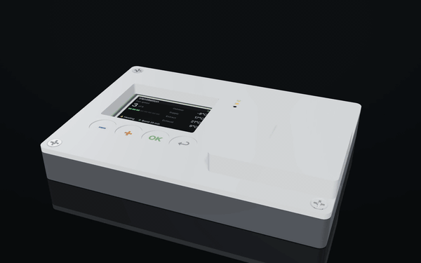
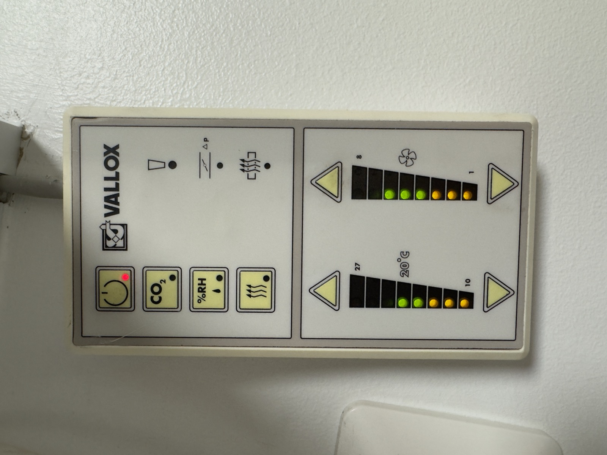
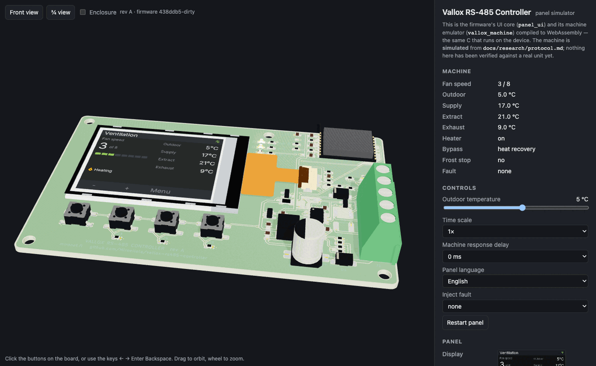

# Vallox RS-485 Controller

Replacement bus controller for legacy Vallox ventilation units.

<p align="center">
  
</p>

*Render of the rev A board inside the parametric enclosure draft — not a photograph;
one replaces this when a device has been built. Stills in [`docs/images/`](docs/images/),
the [browser simulator](https://miroeilola.github.io/vallox-rs485-controller/) shows
the same board live, and the enclosure draft is generated by
[`mechanical/draft/`](mechanical/draft/).*

<!-- Replace the animation with a photo of the finished device once one exists. -->

[](https://github.com/Miroeilola/vallox-rs485-controller/actions/workflows/hardware.yml)
[](https://github.com/Miroeilola/vallox-rs485-controller/actions/workflows/firmware.yml)
[](https://github.com/Miroeilola/vallox-rs485-controller/actions/workflows/simulator.yml)


> **Status: hardware, rev A.** The board is drawn, placed, routed and sourced —
> not yet ordered or built. The supply-rail measurements (M1, M2a) are done and
> the power stage is final; the browser simulator runs the panel firmware's real
> UI core as WebAssembly; the enclosure exists as a parametric draft that Fusion
> 360 will supersede. Nothing has been verified against a real machine yet. What
> is known, what is only reported, and what still has to be measured is written
> down in [`docs/research/`](docs/research/) and [`docs/measurements/`](docs/measurements/).

## What this replaces

Vallox has built residential heat-recovery ventilation units in Finland since the
1970s, and the SE-series machines are still in service in tens of thousands of
houses. The machine outlives its control panel: the mechanics and the heat exchanger
last decades, the panel's keypad and its electrolytics do not, and panels for the
older models are no longer made.

The machines already carry an RS-485 bus, and everything the panel shows — four
temperatures, fan speed, humidity, CO₂, fault and service state — travels over it
in a six-byte telegram. **This board takes the panel's place**: same five
terminals, same wall, no other hardware, and the machine appears in Home Assistant
or MQTT with no manufacturer cloud service in between.



It is a replacement rather than an addition because the bus does not allow the
addition. The manual says up to three panels may share the bus, and three *Vallox*
panels do — the mainboard keeps them in step. A client that polls on its own
schedule does not join that: tested on the target machine, two controllers override
each other. So the old panel comes off.

That has a consequence worth stating up front, before anyone builds one: **once the
panel is gone, this device is how the ventilation gets controlled.** The machine
keeps running at its last setting if the device fails, and every safety function —
frost protection, over-temperature, defrost — stays in the machine's own firmware
where this device cannot reach it. But nothing changes the fan speed until the
device is working again. Keep the original panel in a drawer.

## Try it in the browser

[](https://github.com/Miroeilola/vallox-rs485-controller/actions/workflows/simulator.yml)



**https://miroeilola.github.io/vallox-rs485-controller/** — the panel firmware's UI
core and its machine emulator compiled to WebAssembly, drawn on the rev A board's
3D model. Click the buttons, change the outdoor temperature, inject a fault,
watch the bus log, and tick **Enclosure** to see the board inside the draft case. It is the same C that will run on the device
(`firmware/components/panel_ui`), not a look-alike.

The machine behind it is **simulated** from [`docs/research/protocol.md`](docs/research/protocol.md)
and nothing in it has been verified against a real unit yet; the first bus capture
(M3) corrects the document, then the emulator, then the UI. Details and the build
in [`simulator/README.md`](simulator/README.md).

### This is not the first attempt, and that is worth saying

Several people have solved the software side, and solved it well —
[pvainio](https://github.com/pvainio/vallox-rs485),
[kotope](https://github.com/kotope/valloxesp),
[windkh](https://github.com/windkh/valloxserial),
[pecca](https://github.com/pecca/vallox_control),
[mld18](https://github.com/mld18/ioBroker.valloxSerial) and
[Tom-Bom-badil](https://github.com/Tom-Bom-badil/home-assistant_helios-vallox).
The register map here comes from reading their work and is credited in
[`docs/research/sources.md`](docs/research/sources.md).

What none of them ships is hardware. The usual build is a development board, an
RS-485 breakout and a step-down module, loose inside the machine's cable box. This
project adds the missing half: one board that lands on the panel terminals, survives
the wiring mistake the manufacturer warns about in bold, a measured protocol
description with oscilloscope captures rather than a register map you have to read
out of source code, published measurements, an enclosure and a datasheet.

## Specifications

| | |
|---|---|
| Microcontroller | not fixed — ESP32-C3 proposed, see `hardware/docs/decisions.md` |
| Supply voltage | 22 V DC measured at the panel terminal; range not yet measured |
| Current consumption | — (measured, see `docs/measurements/`) |
| Interfaces | RS-485 half duplex, 9600 8N1, Vallox DIGIT protocol · Wi-Fi 2.4 GHz |
| Local interface | 2.0" 320×240 colour IPS, 4 buttons, 3 indicator LEDs — proposed, see `docs/research/user-interface.md` |
| Mounting | Under the machine, replacing the original panel. No footprint to match |
| Dimensions | — |
| Operating temperature | — |
| Enclosure | — |

Every number in this table comes from a measurement or a component datasheet.
Values still marked `—` have not been measured yet.

## Repository layout

| Path | Contents |
|---|---|
| `hardware/` | KiCad 10 project, manufacturing outputs, order packages |
| `firmware/` | ESP-IDF application and reusable components |
| `esphome/` | ESPHome external component (Home Assistant users start here) |
| `simulator/` | Browser simulator: the UI core and machine model in WebAssembly on the board's 3D model |
| `mechanical/` | Enclosure: STEP source, STL for printing, drawings, print profiles |
| `docs/` | Research, measurements, datasheet, images |

## Building one

### 1. Order the board

```bash
git clone --recurse-submodules https://github.com/Miroeilola/vallox-rs485-controller.git
```

Manufacturing files for the released revision are attached to the GitHub release.
The frozen package that was actually sent to the fab is in
`hardware/orders/<rev>-<date>/`, together with what it cost and how long it took.

### 2. Print the enclosure

The enclosure is currently a **parametric draft** ([`mechanical/draft/enclosure.py`](mechanical/draft/enclosure.py)
→ STEP in [`mechanical/step/`](mechanical/step/)), dimensioned from the board file
and verified against the populated 3D model by a boolean interference check —
Fusion 360 will supersede it as the master. See
[`mechanical/README.md`](mechanical/README.md) for material, print settings and
hardware (screws, heat-set inserts).

### 3. Flash the firmware

```bash
cd firmware
idf.py set-target esp32s3
idf.py build flash monitor
```

Pre-built binaries are attached to each release.

### Home Assistant

See [`esphome/`](esphome/) for the external component and a working example
configuration.

## Measurements

Every claim in this repository is backed by a measurement in
[`docs/measurements/`](docs/measurements/): current consumption per operating mode,
rail voltages and ripple, bus signal integrity, and temperature under load.

One report exists so far — the target panel identified and the bus supply measured
at 22 V. It is published with its own gaps marked: the instrument was not recorded
and the load state was not recorded, which is why the regulator's input range is
still an open question rather than a specification.

## What this does not do

- **The display idles dimmed**, and goes to full brightness on a button press.
  Three indicator LEDs stay lit for power, bus activity and fault, and they are
  what answers "is it running" from the doorway.
- **The board works with the display unplugged.** The display is a separate part
  that plugs into an FPC connector after assembly, so a failed or unfitted display
  never means a dead device.
- **Home Assistant is the primary interface.** The local menu covers fan speed,
  the setpoints and diagnostics, and it is a fallback rather than the main event.
- **It is not a safety device and it is not in any safety path.** The machine's
  frost protection, over-temperature thermostats and defrost cycle are in the
  machine's own firmware. This device cannot reach them and cannot disable them.
- **It does not support Vallox MV.** Those units use Modbus and have their own
  interface. This is for the legacy DIGIT RS-485 bus only.
- **It does not support Vallox 130 D** without changes — that model is reported to
  use different register numbers, and no capture from one exists here.
- **It will claim support only for machines a capture exists from.** Other SE-series
  models and Helios KWL EC/ET units are reported to use the same bus, and reported is
  not the same as verified. Which registers a given machine answers is a property of
  that machine.
- **It does not write registers that have not been verified on hardware.** The
  firmware carries an explicit allow-list, it starts with one entry, and a register
  joins it only when a measurement report exists for it. Vallox warns that writing an
  incorrect register or value can damage the unit.
- **It makes no safety or IP-rating claim.** Nothing has been tested for either.
- **Connecting anything to the machine voids the manufacturer's warranty** and is
  your decision, not this project's.

## The machine this was built against

| | |
|---|---|
| Panel replaced | Vallox DIGIT SE LED panel, two 8-segment bar graphs, no LCD |
| Panel bus transceiver | MAX487 — 1/4 unit load, slew-rate limited |
| Terminal | 5-pole screw, `+ − A B M` |
| Supply measured | 22 V DC |
| Machine model | not yet recorded |

Full write-up with photographs:
[`docs/measurements/2026-08-21-panel-identification.md`](docs/measurements/2026-08-21-panel-identification.md).

**Do not wire by colour.** The manufacturer's manual specifies an orange-and-white
NOMAK cable. The machine this was built against has red, blue, green, yellow and
white in those same five terminals. Identify the terminals on your own machine.

## Tools

[`scripts/vlx-decode`](scripts/vlx-decode/) decodes a raw bus capture into
annotated telegrams and a census of the bus. It shares the codec with the
firmware, so it cannot drift from what the device believes.

```bash
cd scripts/vlx-decode && make && ./vlx-decode --demo
```

## Research

Everything known before the design started, with sources and confidence ratings, is
in [`docs/research/`](docs/research/): the
[protocol](docs/research/protocol.md) and its register map, the
[target device](docs/research/target.md) and its panel pinout, the
[measurement plan](docs/research/measurement-plan.md) that has to run before a
schematic is drawn, the [risks](docs/research/risks.md), and the
[component candidates](docs/research/component-candidates.md) with live stock and
prices.

## License

| Path | License |
|---|---|
| `firmware/`, `esphome/`, `scripts/`, `simulator/` | [MIT](LICENSES/MIT.txt) |
| `hardware/`, `mechanical/` | [CERN-OHL-S-2.0](LICENSES/CERN-OHL-S-2.0.txt) |
| `docs/`, README, images | [CC-BY-SA-4.0](LICENSES/CC-BY-SA-4.0.txt) |

See [LICENSE.md](LICENSE.md) for details.

## About

Designed and built by Miro Eilola / [Mironet](https://mironet.fi).
Mironet designs embedded devices like this one on commission — electronics,
enclosure and firmware from specification to production. miro@mironet.fi
