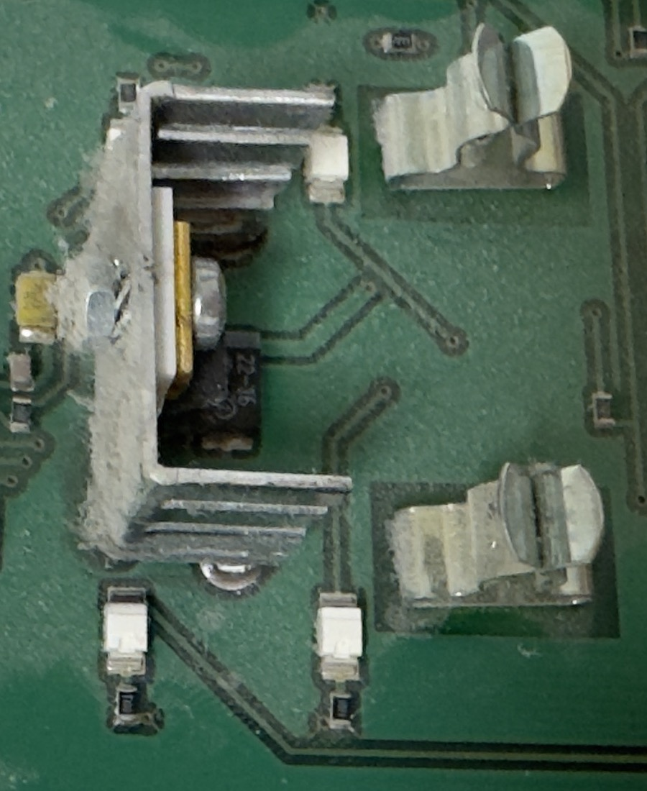

# Target panel identified, and the bus supply measured

| | |
|---|---|
| Date | 2026-08-21 |
| Hardware revision | none — no board exists |
| Firmware version | none |
| Ambient conditions | indoor, machine running normally, not recorded further |
| Measured by | Miro Eilola |
| Report written from | photographs and a reported reading, not from witnessing the measurement |

## Question

What panel is being replaced, what is physically on its terminal block, and what
voltage does the machine actually put on the supply pair?

This is measurement M0 and the supply-voltage row of M1 in
[`../research/measurement-plan.md`](../research/measurement-plan.md). **The rest
of M1 is not answered here** — see *Still open* at the end.

## Setup

The panel was removed from its wall plate with the machine running and the wiring
left connected, and photographed front and back. The supply voltage was measured
at the terminal block with a multimeter.

**Instrument not recorded.** Multimeter make and model, and whether the reading
was taken with the panel connected or disconnected, are unknown to this report.
Both go in the next time, because a reader cannot weigh a 22 V figure without
them.

## Results

### The panel

A **Vallox DIGIT SE LED control panel** — the variant with two eight-segment LED
bar graphs and no LCD. This is the same class of panel that `pvainio/vallox-rs485`
was developed against and describes as "the one with the old led panel, no lcd
panel".

Front-panel controls, left to right along the bottom: power (its LED lit red in
the photograph), CO₂ control, %RH control, post-heating. Indicator dots along the
top: a funnel symbol, a filter-guard differential-pressure symbol, and a
heat-exchanger symbol. Right-hand half: fan speed 1…8 with left/right buttons, and
a temperature scale marked 10…27 °C with 20 °C printed at the middle, also with
left/right buttons.

At the moment of the photograph six of the eight fan-speed segments and six of the
eight temperature segments were lit. Reading a setting off a photograph is not a
measurement, so no fan speed or setpoint is claimed here.

### The terminal block

Five-pole screw terminal, silkscreen `+  −  A  B  M` reading left to right, which
matches the Vallox Digit2 SE manual exactly.

**The installed cable does not use the manufacturer's colour code.** The manual
specifies NOMAK 2×2×0.5 mm² + 0.5 mm² with orange 1 / white 1 / orange 2 /
white 2 / screen. What is actually in the terminal is a five-conductor cable:

| Terminal | Function | Wire colour as installed |
|---|---|---|
| 1 | + | red |
| 2 | − | blue |
| 3 | A | green |
| 4 | B | yellow |
| 5 | M | white |

This matters more than it looks. Every published guide for this bus describes the
wiring by colour, and in this house the colours are different. The silkscreen on
the replacement therefore has to label by **function and terminal position**, and
the installation instructions have to tell the reader to identify the terminals on
their own machine rather than trust a colour.

### Supply voltage

| Measurement | Value | Notes |
|---|---|---|
| Terminal 1 (+) to terminal 2 (−) | **22 V DC** | Reported reading. Load condition and instrument not recorded. |

Against the manufacturer's "n. 21 VDC" and one community report of 24 V, the
measured 22 V sits between them. It confirms the order of magnitude and confirms
that a design centred on 21 V nominal is not going to be surprised by this
machine. It does **not** yet give the range: no reading was taken with the panel
disconnected, or with the machine at full fan speed with heating on, and those two
are the ends the regulator has to survive.

### What the original panel does with that voltage

A TO-220 regulator bolted to a folded aluminium heatsink, in the middle of the
board. That is a **linear** regulator dropping roughly 22 V to the board's logic
rail, and the heatsink says the dissipation is not trivial.

This is indirect evidence on the open question of how much current the rail can
supply, and it points the right way. A linear regulator that needs a heatsink is
burning something on the order of a watt, so the rail was designed to source at
least the panel's own draw — sixteen LEDs, a microcontroller and an RS-485
transceiver — through that drop. It is a prior, not a measurement, and M2 still
has to produce the number.

It also sets a benchmark worth publishing later: a switching regulator in the
replacement should draw **less** from the bus than the panel it replaces, while
doing more. That is a comparison this project can actually make, because the
original is here to measure.

### The bus transceiver in the original

Visible in the terminal photograph, immediately below the terminal block: a
SOIC-8 marked **MAX487 CSA .037**.

The MAX487 is a 1/4-unit-load, slew-rate-limited RS-485 transceiver: 48 kΩ
receiver input impedance, up to 128 nodes, error-free to 250 kbps
([Analog Devices datasheet](https://www.analog.com/media/en/technical-documentation/data-sheets/MAX1487-MAX491.pdf)).

That is a design constraint for the replacement, and a useful one:

- **Bus loading.** The machine's driver was specified against a 1/4-unit-load
  panel. The replacement should present the same load or less, so that removing
  the original and fitting this one does not change what the machine's driver
  sees.
- **Slew rate.** The original deliberately uses a slew-limited driver at 9600
  baud. Fitting a 10 Mbps part in its place would raise emissions on a cable that
  runs through a house for no benefit at all.

### Other parts identified

- PLCC-44 device, covered by a white label printed `00039C / 200298` — the panel's
  microcontroller and, judging by the label, its firmware revision. The part
  number is under the label and was not read.
- Two rows of eight LEDs, driven directly from the board.
- Two tall formed-metal parts near the middle of the board, which are the
  mechanical interface to the front assembly.

## Interpretation

1. The panel is the LED variant of the Vallox DIGIT SE, which is the best-covered
   variant in the existing open-source work. The register map compiled in
   [`../research/protocol.md`](../research/protocol.md) was largely derived from
   this same class of machine, which raises confidence in it — without making any
   of it measured.
2. The supply pair carries 22 V, consistent with the manufacturer's figure. The
   design input range still has to come from readings at both ends of the load.
3. The original panel is bus-powered through a linear regulator with a heatsink,
   which is a good sign for the replacement being bus-powered too.
4. Two requirements arrived that were not in the specification before: match or
   better the MAX487's bus loading, and keep the driver slew-rate limited.
5. The installed wire colours do not match the manufacturer's documentation, which
   changes how the installation instructions have to be written.

## Deviations

- **The measurement conditions were not recorded.** The 22 V figure has no
  instrument, no load state and no ambient temperature attached to it. It is
  recorded as reported and is enough to confirm the order of magnitude; it is not
  enough to set a regulator's input range, and it is not treated as if it were.
- The panel's LED states were photographed but are not reported as readings.
- The panel was opened with the machine energised. The bus is extra-low voltage,
  but whether it is genuinely isolated from mains has not been established, which
  is exactly the next item.

## Still open

The two rows of M1 that gate everything else are **not** answered by this report:

- Terminal 2 (−) and terminal 5 (M) to protective earth, AC and DC. Until that
  reading exists, the panel bus is treated as possibly mains-referenced.
- The supply voltage at no load and at full machine load, and its ripple.

M2, how much current the rail can supply, is also still open. The heatsink is a
hint, not a number.
