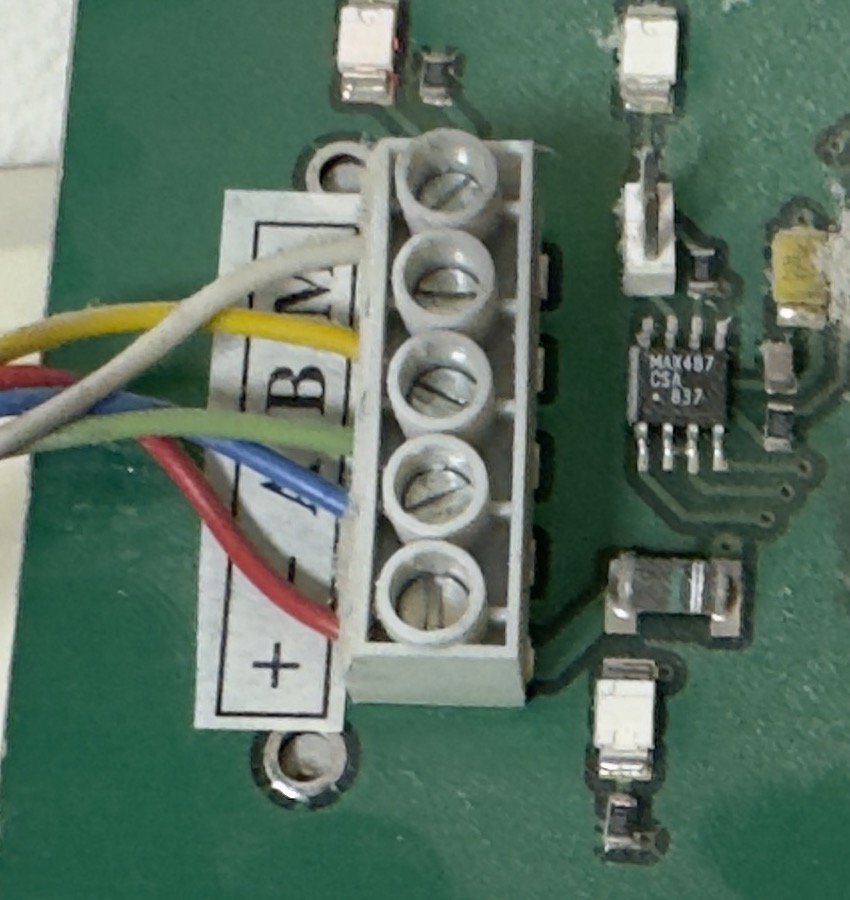

# Target device

The device this controller talks to, and the panel it replaces or joins.

## The machine

Vallox has built residential heat-recovery ventilation units in Finland since the
1970s. The generation relevant here is the **SE series** — units whose control
electronics use the Vallox DIGIT RS-485 bus and an external wall panel as the user
interface. The units outlive their panels: the mechanical parts and the heat
exchanger last decades, while the panel's membrane keypad, its display and its
electrolytic capacitors do not, and replacement panels for the older models are no
longer manufactured.

### Models reported to speak this bus

Compiled from the three implementations that list verified hardware. This list is
**reported, not verified by this project** — every entry is `reverse-engineered`
confidence until a capture from that model exists.

| Model | Reported by |
|---|---|
| Vallox Digit SE, Digit SE 2 | kotope, Tom-Bom-badil |
| Vallox Digit SE 3500 SE (2001, LED panel) | pvainio |
| Vallox 080 / 090 / 096 / 110 / 121 / 130 D / 140 / 145 / 150 / 180 / 270 SE | kotope, Tom-Bom-badil, Creating Smart Home |
| Vallox ValloPlus 350 / 500 / 510 / 910 SE | kotope, Tom-Bom-badil |
| Helios KWL EC / ET, EC 200/300/500 Pro | FHEM wiki, Tom-Bom-badil |

Two qualifications that matter for the scope of this project:

- **Vallox 130 D needs different register numbers.** Tom-Bom-badil states this
  explicitly. Whatever this project claims to support has to be narrower than
  "Vallox".
- **Vallox MV units are a different product.** They use Modbus and an Ethernet
  interface and are out of scope. This board is for the legacy bus only.

### The unit this project is developed against

Partly identified on 2026-08-21 — see
[`../measurements/2026-08-21-panel-identification.md`](../measurements/2026-08-21-panel-identification.md).

| | |
|---|---|
| Machine model | not determined — the model plate has not been photographed |
| Year of manufacture | not determined |
| Serial number | not determined |
| Existing panel | **Vallox DIGIT SE LED panel**, two 8-segment bar graphs, no LCD |
| Panel bus transceiver | **MAX487**, 1/4 unit load, slew-rate limited |
| Panel logic supply | linear regulator, TO-220 on a folded heatsink |
| Panel controller | PLCC-44, part number hidden under a firmware label `00039C / 200298` |
| Panels on the bus | one |
| Supply at the terminal | **22 V DC measured**, load condition not recorded |
| CO₂ sensors fitted | not determined |
| %RH sensors fitted | not determined |
| Fan type | not determined — AC (transformer-tapped) or DC (0xB0/0xB1 present) |
| Heater type | not determined — electric or water coil |

The remaining rows still need physical access: the model plate and the connection
box. They are not decoration. The fan type decides whether registers 0xB0 and 0xB1
exist, and the heater type decides whether the pre-heat and water-coil frost
registers mean anything on this machine.

The panel being replaced. Power, CO₂, %RH and post-heating buttons on the left;
fan speed 1…8 and a 10…27 °C scale as LED bar graphs on the right. Everything this
panel can do, the replacement has to do or explicitly drop.

## The panel interface

From the Vallox Digit2 SE manual, section *Ohjainpaneelin asennus, irroitus ja
johdotus*. This is a manufacturer source and is quoted here because everything in
the electrical design hangs off it.

| Terminal | Wire in NOMAK cable | Signal | Colour as actually installed |
|---|---|---|---|
| 1 | orange 1 | **+** — approx. 21 VDC, 22 V measured | red |
| 2 | white 1 | **–** — return for the supply | blue |
| 3 | orange 2 | **A** — RS-485 | green |
| 4 | white 2 | **B** — RS-485 | yellow |
| 5 | metal screen | **M** — signal ground | white |

The right-hand column is from the machine this project is being built against, and
it does not match the manufacturer's colour code at all. Every published guide for
this bus describes the wiring by colour; in this house the colours are different.
The replacement's silkscreen therefore labels by function and terminal position,
and the installation instructions tell the reader to identify the terminals on
their own machine rather than trust a colour.

Cable specified by the manufacturer: NOMAK 2 × 2 × 0.5 mm² + 0.5 mm², i.e. two
twisted pairs plus a screen. The power pair and the data pair are separate twisted
pairs; the screen is a functional conductor here, not just a shield, and it carries
the signal reference.

The manual prints one warning in bold next to this table:

> HUOM! (+) johdon virheellinen kytkentä tuhoaa ohjainpaneelin!
> *(Incorrect connection of the (+) wire destroys the control panel.)*

That sentence is a design requirement, not a caution. A replacement panel that dies
the same way is not an improvement, so reverse-polarity survival on the 21 V input
is a hard requirement for this board and is the first thing that will be tested.

### Panel addressing

Up to three panels may share the bus. The manual's procedure is to connect them one
at a time and set addresses downward from 3, ending with the last panel at address 1.
Two panels with the same address put the bus into `väylävika` (bus fault) state.

This board therefore has to be configurable to an address that is free, and the
firmware has to default to something that cannot collide with a factory panel.

### Where the 21 V comes from

The internal wiring diagram in the same manual labels the supply transformer
`M = Säästömuuntaja suojajännitekäämillä` — an autotransformer with a
protective-voltage (safety extra-low voltage) winding. The autotransformer is what
gives the SE series its eight discrete fan speeds: the AC fan motors are fed from
tapped windings, which is exactly why fan speed on this bus is a bit-mask
`0x01, 0x03, 0x07 … 0xFF` rather than a number.

The reading that matters for safety is the second half of the label: the 21 V panel
supply is stated to come from a separate protective-voltage winding, not from the
autotransformer's mains-referenced part. **That reading is from a low-resolution
scan of a wiring diagram and it must be confirmed by measurement before anything
is connected**, because if it is wrong, the panel bus is mains-referenced and the
entire design changes.

## The replacement replaces the panel

The original panel comes off the wall and this device goes on in its place, wired
to the same five terminals. It is not an additional client on the bus.

That is not a preference, it is what the bus allows. The manufacturer's manual
says up to three panels may share the bus, and three Vallox panels do work — but
a client that polls on its own schedule does not coexist with a factory panel:
**tested on this machine, two controllers override each other.** See the decision
record in [`../../hardware/docs/decisions.md`](../../hardware/docs/decisions.md).

### Must

- Take the panel's place electrically: one device on the panel side of the bus,
  at the address the panel used.
- Read the four NTC temperatures, fan speed, and the status the panel displayed.
- Write fan speed and the four writable bits of register 0xA3 — the machine has
  no other user interface once the panel is gone.
- Read and write the setpoints the panel could set: heating, bypass, pre-heat,
  supply-fan stop, and the fan speed limits. **Every one of these was previously
  reachable from the wall and must not silently become unreachable.**
- Take its own power from the bus, with no separate supply.
- Survive reversed supply wiring and a swapped A/B pair.
- Present a bus load no heavier than the MAX487 it replaces, with a slew-rate
  limited driver, so the machine's driver sees the same bus or an easier one.

### Should

- Read RH and CO₂ if the unit has those sensors.
- Trigger the fireplace/boost function and report its remaining time.
- Report the filter service counter and the fault register.

### Will not

- Touch anything on the mains side of the machine.
- Claim support for Vallox MV, or for Vallox 130 D, without a capture from one.

### Where it lives, and what that permits

The panel is mounted **under the machine**, in a technical space — not on a
living-room wall. There is no footprint to match, nothing to cover up and no size
constraint. The replacement is free to be whatever shape suits it.

That is worth stating because it removes a constraint that would otherwise have
driven the mechanical design, and because it changes what the local interface is
for: this is a place people visit when something needs attention, not a thing they
look at every day.

### Local interface

Analysed in full, with live prices and the power arithmetic, in
[user-interface.md](user-interface.md).

Short version: **a 2.0" 320 × 240 colour IPS, three buttons, and three always-on
indicator LEDs.** About $4.15 per finished device, of which only about $0.30 lands
on the assembled board — the display is a bare panel plugged into an FPC connector
after assembly, so the same board takes either option or none.

The reason is not the display itself. It is that the panel being removed could set
the heating setpoint from the wall, and matching that with LEDs means rebuilding a
2001 keypad. A display and three buttons is a menu — but only if the display is
big enough to show one. At arm's length a 0.96" OLED gives eight characters by
three lines, which is not, and colour TFT costs three to five times less per square
millimetre than mono OLED, so the bigger screen is also the cheaper one.

The argument against is in the same file and it is a good one: the LEDs in the
original panel outlived its electrolytics.

## What the user ends up with

A device on the wall where the panel was, on the same five wires, appearing in
Home Assistant as a climate entity with temperatures, fan speed, humidity and
service state — with no manufacturer cloud service and no gateway hardware, and
with the machine still controllable by hand when the network is not there.
